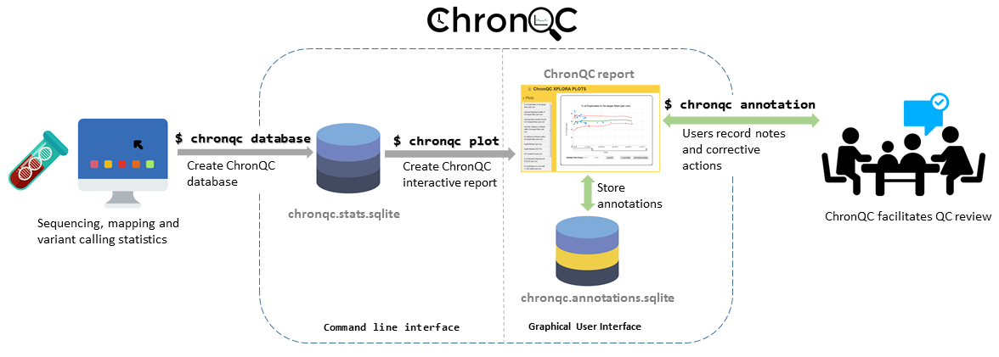

.. ChronQC documentation master file, created by

Introduction
============

Features
--------

* Designed for quality control based on historical data
* Generates interactive time-series plots for various metrics, allowing comparison of the current run to historical runs
* Record users' notes and corrective actions directly onto the graphs for long-term record-keeping
* Provides highly customizable different chart types
* Supports customized database for plotting
* Works with output of MultiQC

ChronQC is an open-source, interactive, record-keeping QC system. ChronQC captures QC data from `MultiQC <https://github.com/ewels/MultiQC>`_. output and stores the metrics in a database. ChronQC then automatically generates interactive time-series plots for various metrics, allowing comparison of the current run to historical runs. In QC meetings, users can record their notes and corrective actions directly onto the graphs for long-term record-keeping.

ChronQC Workflow
----------------

Example live ChronQC report:
----------------------------

`https://nilesh-tawari.github.io/chronqc <https://nilesh-tawari.github.io/chronqc>`_

