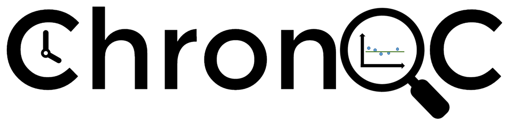

.. ChronQC documentation master file, created by

.. image:: https://anaconda.org/bioconda/peddy/badges/installer/conda.svg
        :target: https://conda.anaconda.org/bioconda

.. image:: https://img.shields.io/pypi/v/ChronQC.svg
        :target: https://pypi.python.org/pypi/ChronQC

.. image:: https://readthedocs.org/projects/chronqc/badge/?version=latest
        :target: http://chronqc.readthedocs.io/en/latest/?badge=latest

An Open-source Quality Control Monitoring System for Clinical NGS
=================================================================

* Free software: MIT license
* Documentation: http://chronqc.readthedocs.io/en/latest/.

Features
--------

* Designed for quality control based on historical data
* Generates interactive time-series plots for various metrics, allowing comparison of the current run to historical runs
* Record users' notes and corrective actions directly onto the graphs for long-term record-keeping
* Provides highly customizable different chart types
* Supports customized database for plotting
* Works with output of MultiQC

ChronQC is an open-source, interactive, record-keeping QC system. ChronQC captures QC data from `MultiQC <https://github.com/ewels/MultiQC>`_. output and stores the metrics in a database. ChronQC then automatically generates interactive time-series plots for various metrics, allowing comparison of the current run to historical runs. In QC meetings, users can record their notes and corrective actions directly onto the graphs for long-term record-keeping.

Example live ChronQC report:
----------------------------

`https://nilesh-tawari.github.io/chronqc <https://nilesh-tawari.github.io/chronqc>`_

.. toctree::
    :maxdepth: 2
    :caption: ChronQC

    chronqc

.. toctree::
    :maxdepth: 2
    :caption: ChronQC Set up

    chronqc_setup.rst

.. toctree::
    :maxdepth: 2
    :caption: Run ChronQC

    run_chronqc

.. toctree::
    :maxdepth: 2
    :caption: Type of ChronQC plots

    plots/plot_options
    plots/timeseries_mean_n_stddev
    plots/timeseries_absolute_threshold
    plots/timeseries_percentage_samples_abv_threshold
    plots/timeseries_box_whisker
    plots/timeseries_percentage_category
    
.. toctree::
    :maxdepth: 2
    :caption: Citation

    citation.rst
