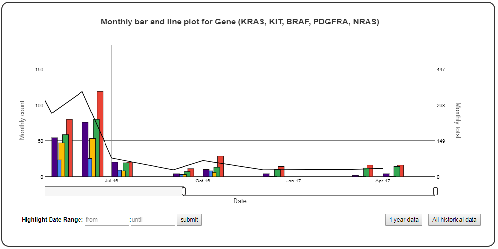

Time series bar line plot of the categorical data
=================================================

A time series bar line plot of the categorical data. Count of categorical ``y_value`` values of ``categories`` in the SQLite table defined by ``table_name`` is used to plot this graph.
SQLite table must have; ``Sample, Date, y_value`` columns to generate the plot. 
If ``Run`` column is present instead of ``Sample`` column in the table, ``Run`` column is used to generate plots.

Example Plot
````````````



Chart Properties
````````````````

+------------------+-----------------------------------+-----------------------------------------------------------------------------------------------+
| Option           | Type                              | Use                                                                                           |
+==================+===================================+===============================================================================================+
| Chart_title      | String (Optional)                 | This is used to create the title of the chart.                                                |
|                  |                                   | Default is  "Monthly bar and line plot for {y_label} ({categories})".                         |
|                  |                                   | E.g. "Monthly bar and line plot for Gene (KRAS, KIT, BRAF, PDGFRA, NRAS)".                    |
+------------------+-----------------------------------+-----------------------------------------------------------------------------------------------+
| y_value          | String (Required)                 | Column header in SQLite table. The column should contain categorical data.                    |    
|                  |                                   | Count of categories defined by "categories" option is plotted on the y1-axis and sum is       |
|                  |                                   | plotted on the y2-axis. E.g. "Gene".                                                          |
+------------------+-----------------------------------+-----------------------------------------------------------------------------------------------+
| y_label          | String (Optional)                 | This is used to create the y1-axis label in the chart.                                        |
|                  |                                   | Default is "Monthly count".                                                                   |
+------------------+-----------------------------------+-----------------------------------------------------------------------------------------------+
| y_label2         | String (Optional)                 | This is used to create the y2-axis label in the chart.                                        |
|                  |                                   | Default is "Monthly total".                                                                   |
+------------------+-----------------------------------+-----------------------------------------------------------------------------------------------+
| categories       | String (Required)                 | This is used to select subset of categories from the SQLite table's y_value column. Maximum   |
|		   |                                   | 10 categories can be specified in a single graph. To track more than 10 categories create     |
|		   |				       | multiple graphs. 									       |
|                  |                                   | E.g. "KRAS, KIT, BRAF, PDGFRA, NRAS".                                                         |
+------------------+-----------------------------------+-----------------------------------------------------------------------------------------------+


Example JSON entry (minimum)::

     [
      {
       "chart_type": "time_series_with_bar_line_plot",
       "chart_properties": {
           "y_value": "Gene",
           "categories": "KRAS, KIT, BRAF, PDGFRA, NRAS"
           }
      }
     ]

Example JSON entry (full) to plot all samples excluding NTC ::

     [
      {
       "table_name": "VCS_Stats_Summary",
       "include_samples": "all",
       "exclude_samples": "NTC",
       "chart_type": "time_series_with_bar_line_plot",
       "chart_properties": {
            "chart_title": "Monthly bar and line plot for Gene (KRAS, KIT, BRAF, PDGFRA, NRAS)",
            "y_value": "Gene",
            "categories": "KRAS, KIT, BRAF, PDGFRA, NRAS",
            "y_label": "Monthly count",
            "y_label2": "Monthly total"
            } 
      }
     ]


