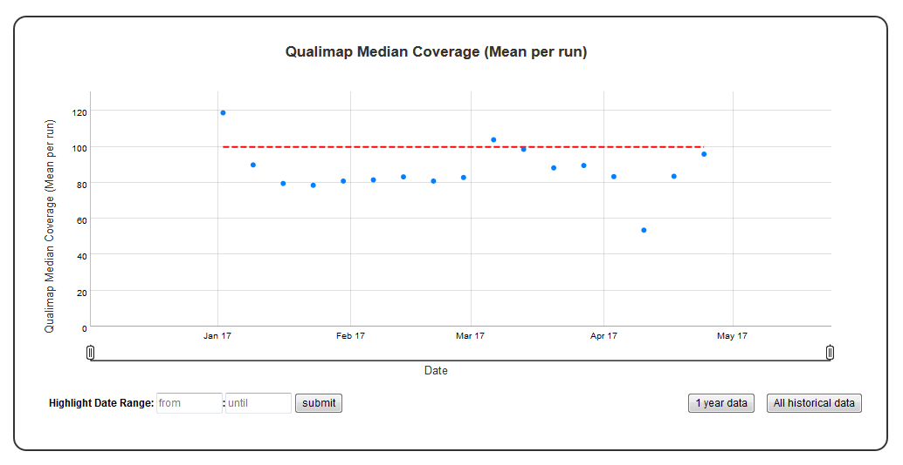

Time series plot with absolute threshold
========================================

A time series plot of numerical data with user defined lower and upper thresholds. Numerical data in ``y_value`` column of the SQLite table defined by ``table_name`` is used to plot this graph.
SQLite table must have; ``Run, Sample, Date, y_value`` columns to generate the plot. 
In case of ``per_sample`` graph ``Run`` column is not required.  
For ``per_sample`` graph if only ``Run`` column is present in the table, ``Run`` column is used to generate plots.


Example Plot
````````````



Chart Properties
````````````````

+------------------+-----------------------------------+-----------------------------------------------------------------------------------------------+
| Option           | Type                              | Use                                                                                           |
+==================+===================================+===============================================================================================+
| Chart_title      | String (Optional)                 | This is used to create the title of the chart.                                                |
|                  |                                   | Default is  "{y_label} (Mean per run)".                                                       |
|                  |                                   | E.g. "Qualimap Median Coverage (Mean per run)".                                               |
+------------------+-----------------------------------+-----------------------------------------------------------------------------------------------+
| y_value          | String (Required)                 | Column header in SQLite table. The column should contain numeric data.                        |    
|                  |                                   | This data is plotted on the y-axis.                                                           |
|                  |                                   | E.g. "Depth".                                                                                 |
+------------------+-----------------------------------+-----------------------------------------------------------------------------------------------+
| y_label          | String (Optional)                 | This is used to create the y-axis label in the chart.                                         |
|                  |                                   | Default is "{y_value} (Mean per run)".                                                        |
|                  |                                   | E.g. "Qualimap Median Coverage (Mean per run)".                                               |
+------------------+-----------------------------------+-----------------------------------------------------------------------------------------------+
| lower_threshold  | Integer (Optional)                | This is used to create lower threshold line on the chart.                                     |
|                  |                                   | E.g. 100.                                                                                     |
+------------------+-----------------------------------+-----------------------------------------------------------------------------------------------+
| upper_threshold  | Integer (Optional)                | This is used to create upper threshold line on the chart.                                     |
|                  |                                   | E.g. 300.                                                                                     |
+------------------+-----------------------------------+-----------------------------------------------------------------------------------------------+
| per_sample       | Boolean (Optional)                | Plot per sample graph. Default is "False".                                                    |
|                  |                                   | If set to "True" per sample graph will be plotted.                                            |
+------------------+-----------------------------------+-----------------------------------------------------------------------------------------------+


Example JSON entry (minimum)::

     [
      {
       "chart_type": "time_series_with_absolute_threshold",
       "chart_properties": {
           "y_value": "Depth",
           "lower_threshold": 100,
           }
      }
     ]

Example JSON entry (full) to plot all samples excluding HCT15 and NTC::

     [
      {
       "table_name": "Production_Run_Stats_Summary",
       "include_samples": "all",
       "exclude_samples": "HCT15, NTC",
       "chart_type": "time_series_with_absolute_threshold",
       "chart_properties": {
           "chart_title": "Qualimap Median Coverage (Mean per run)",
           "y_value": "Depth",
           "lower_threshold": 100,
           "y_label": "Qualimap Median Coverage (Mean per run)",
           "per_sample": "True"
           }
      }
     ]


