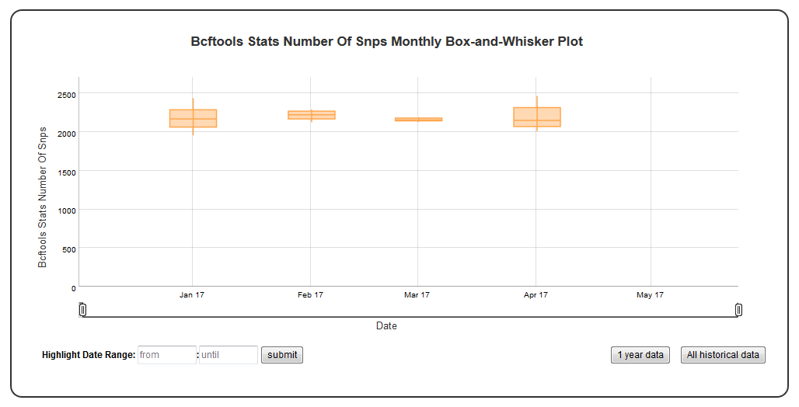

Time series Box-and-Whisker plot of the numerical data
======================================================


A time series Box-and-Whisker plot of numerical data.


Example Plot
````````````



Chart Properties
````````````````

+------------------+-----------------------------------+-----------------------------------------------------------------------------------------------+
| Option           | Type                              | Use                                                                                           |
+==================+===================================+===============================================================================================+
| Chart_title      | String (Optional)                 | This is used to creates the tile of the chart.                                                |
|                  |                                   | Default is  "{y_label} Monthly Box-and-Whisker Plot".                                         |
|                  |                                   | E.g. "Bcftools Stats Number Of Snps Monthly Box-and-Whisker Plot".                            |
+------------------+-----------------------------------+-----------------------------------------------------------------------------------------------+
| y_value          | String (Required)                 | Column header in SQLite table. The column should contain numeric data.                        |    
|                  |                                   | This data is plotted on the y-axis.                                                           |
|                  |                                   | E.g. "Number".                                                                                |
+------------------+-----------------------------------+-----------------------------------------------------------------------------------------------+
| y_label          | String (Optional)                 | This is used to create the y-axis label in the chart.                                         |
|                  |                                   | Default is "{y_label}".                                                                       |
|                  |                                   | E.g. "Bcftools Stats Number Of Snps".                                                         |
+------------------+-----------------------------------+-----------------------------------------------------------------------------------------------+
| threshold        | Integer (Required)                | This is used to select subset of rows from the SQLite table's "Type" columns.                 |
|                  |                                   | E.g. "SNPs".                                                                                  |
+------------------+-----------------------------------+-----------------------------------------------------------------------------------------------+


Example JSON entry (minimum)::

     [
      {
       "chart_type": "time_series_with_box_whisker_plot",
       "chart_properties": {
        "y_value": "Bcftools_Stats_number_of_SNPs"
       }
      }
     ]

Example JSON entry (full) to plot all samples excluding HCT15 and NTC ::

     [
      {
       "table_name": "SNPs_Indels_Stats_Summary",
       "include_samples": "all",
       "exclude_samples": "HCT15, NTC",
       "chart_type": "time_series_with_box_whisker_plot",
       "chart_properties": {
        "chart_title": "Bcftools Stats Number Of Snps Monthly Box-and-Whisker Plot",
        "y_value": "Number",
        "threshold": "SNPs",
        "y_label": "Bcftools Stats Number Of Snps"
       }
      }
     ]


