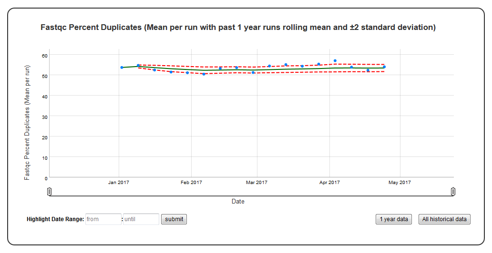

Time series plot with mean and standard deviation
=================================================

A time series plot of numerical data with rolling mean and standard deviation. Numerical data in ``y_value`` column of the SQLite table defined by ``table_name`` is used to plot this graph.
SQLite table must have; ``Run, Sample, Date, y_value`` columns to generate the plot. 
In case of ``per_sample`` graph ``Run`` column is not required.  
For ``per_sample`` graph if only ``Run`` column is present in the table, ``Run`` column is used to generate plots.

Example Plot
````````````



Chart Properties
````````````````

+------------------+-----------------------------------+-----------------------------------------------------------------------------------------------+
| Option           | Type                              | Use                                                                                           |
+==================+===================================+===============================================================================================+
| Chart_title      | String (Optional)                 | This is used to create the title of the chart.                                                |
|                  |                                   | Default is "{y_label} (Mean per run with {window} rolling mean and ± standard deviation)".    |
|                  |                                   | E.g. "Fastqc Percent Duplicates (Mean per run with past 1 year runs rolling mean and ±2       |
|                  |                                   | standard deviation)".                                                                         |
+------------------+-----------------------------------+-----------------------------------------------------------------------------------------------+
| y_value          | String (Required)                 | Column header in SQLite table. The column should contain numerical data.                      |    
|                  |                                   | This data is plotted on the y-axis.                                                           |
|                  |                                   | E.g. "FastQC_percent_duplicates".                                                             |
+------------------+-----------------------------------+-----------------------------------------------------------------------------------------------+
| y_label          | String (Optional)                 | This is used to create the y-axis label in the chart.                                         |
|                  |                                   | Default is "Mean {y_value} per run".                                                          |
|                  |                                   | E.g. "FastQC Percent Duplicates".                                                             |
+------------------+-----------------------------------+-----------------------------------------------------------------------------------------------+
| window           | Integer or String (Optional)      | Window can be an integer (n) or number of days in the format "365D" (d). If an integer (n) is |
|                  |                                   | is specified, rolling mean and standard deviation is computed based on past "n" runs. If      |
|                  |                                   | number of days (d) is specified, rolling mean and standard deviation is computed based on runs|
|                  |                                   | in the past "d". E.g. 1. window="10", this will compute rolling mean and standard deviation   |
|                  |                                   | based on past 10 runs. 2. window="365D", this will compute rolling mean and standard deviation|
|                  |                                   | on the runs in past 365 days. Default is "365D".                                              |
+------------------+-----------------------------------+-----------------------------------------------------------------------------------------------+
| per_sample       | Boolean (Optional)                | Plot per sample graph. Default is “False”.                                                    |
|                  |                                   | If set to “True” per sample graph will be plotted.                                            |
+------------------+-----------------------------------+-----------------------------------------------------------------------------------------------+


Example JSON entry (minimum)::

     [
      {
       "chart_type": "time_series_with_mean_and_stdev",
       "chart_properties": {
           "y_value": "FastQC_percent_duplicates"
           }
      },
     ]

Example JSON entry (full) to plot all samples excluding HCT15 and NTC::

     [
      {
       "table_name": "Production_Run_Stats_Summary",
       "include_samples": "all",
       "exclude_samples": "HCT15, NTC",
       "chart_type": "time_series_with_mean_and_stdev",
       "chart_properties": {
            "chart_title": "Fastqc Percent Duplicates (Mean per run with past 1 year runs rolling mean and &plusmn standard deviation)",
            "y_value": "FastQC_percent_duplicates",
            "y_label": "FastQC Percent Duplicates",
            "window" : "10",
            "per_sample": "False"
       }
      }
     ]


