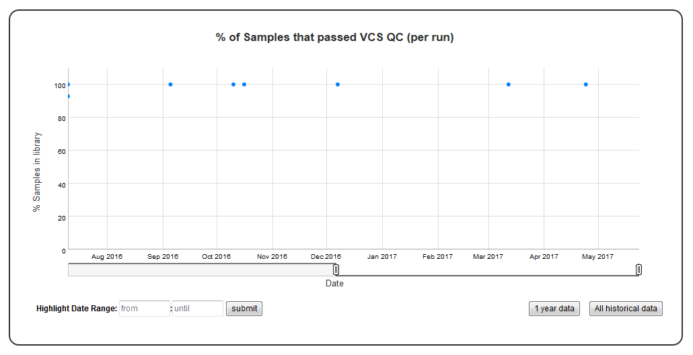

Time series plot with percentage category
=========================================

A time series plot of categorical data in ``y_value`` column of the SQLite table defined by ``table_name``. Represents % of samples in a run with ``y_value`` is equal to category (defined by ``category``).
SQLite table must have; ``Run, Sample, Date, y_value`` columns to generate the plot. 

Example Plot
````````````



Chart Properties
````````````````

+------------------+-----------------------------------+-----------------------------------------------------------------------------------------------+
| Option           | Type                              | Use                                                                                           |
+==================+===================================+===============================================================================================+
| Chart_title      | String (Optional)                 | This is used to create the title of the chart.                                                |
|                  |                                   | Default is "% Samples per run with {y_label} = {category}".                                   |
|                  |                                   | E.g. "% of Samples that passed VCS QC (per run)".                                             |
+------------------+-----------------------------------+-----------------------------------------------------------------------------------------------+
| y_value          | String (Required)                 | Column header in SQLite table. % of samples with y_value = category is plotted on y-axis.     |    
|                  |                                   | E.g. "vcs_coverage_qc".                                                                       |
+------------------+-----------------------------------+-----------------------------------------------------------------------------------------------+
| y_label          | String (Optional)                 | This is used to create the y-axis label in the chart.                                         |
|                  |                                   | Default is "% {y_value} = {category}".                                                        |
|                  |                                   | E.g. "% Samples in library".                                                                  |
+------------------+-----------------------------------+-----------------------------------------------------------------------------------------------+
| category         | String (Required)                 | This is used to calculate the % of samples = "category". String matching is done by ignoring  |
|                  |                                   | the case for values.                                                                          |
|                  |                                   | Default is "PASS". E.g. "PASS".                                                               |
+------------------+-----------------------------------+-----------------------------------------------------------------------------------------------+


Example JSON entry (minimum)::

     [
      {
       "chart_type": "time_series_with_percentage_category",
       "chart_properties": {
            "y_value": "vcs_coverage_qc",
            }
      }
     ]

Example JSON entry (full) to plot all samples excluding HCT15 and NTC::

     [
      {
       "table_name": "Production_Run_Stats_Summary",
       "include_samples": "all",
       "exclude_samples": "HCT15, NTC",
       "chart_type": "time_series_with_percentage_category",
       "chart_properties": {
            "chart_title": "% of Samples that passed VCS QC (per run)",
            "y_value": "vcs_coverage_qc",
            "y_label": "% Samples in library",
            "category": "PASS"
            }
      }
     ]


